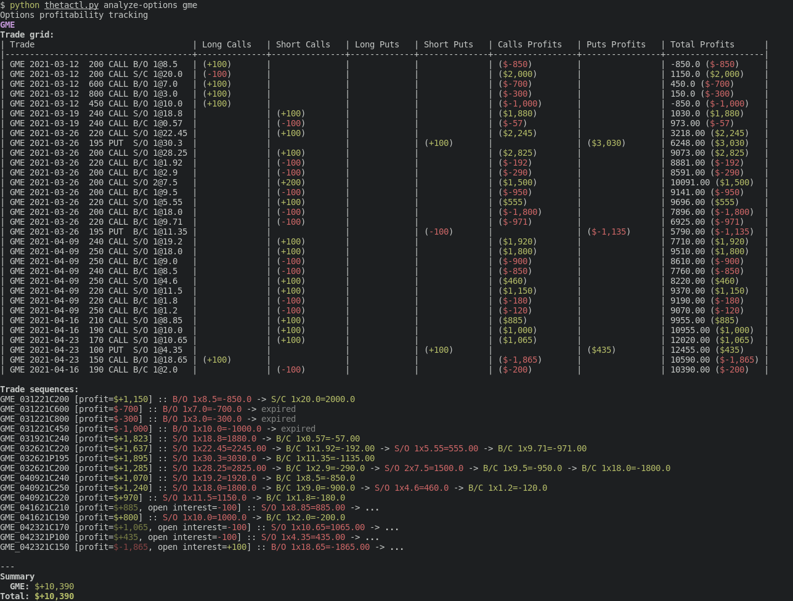

# `thetactl`

> Track your options profitability

`thetactl` is still in the alpha testing phase. Use at your own risk and
[file issues](https://github.com/mgalgs/thetactl/issues) at will!

## Installation

`thetactl` requires Python 3.7 or later.

Currently you need to clone this repo to use `thetactl`:

    git clone https://github.com/mgalgs/thetactl.git

then initialize the virtualenv:

    cd thetactl/src
    python3 -m venv venv
    source venv/bin/activate
    pip install -U pip
    pip install -r requirements.txt

## Configuration

To start using `thetactl` you first need to configure a brokerage
account. Currently supported brokerages:

  - TD Ameritrade

To configure an account, activate the `thetactl` virtual environment as
described in the Installation section above and run:

    python thetactl.py add-broker

And just follow the prompts!

## Usage

Analyze all options activity on your account:

    python thetactl.py analyze-options

Analyze options activity for a specific set of symbols:

    python thetactl.py analyze-options gme uuuu

Show the report for the past 3 weeks:

    python thetactl.py analyze-options --since="3 weeks ago"

Show February's report:

    python thetactl.py analyze-options --since="Feb 1" --until="Mar 1"

## Limitations

We currently don't have any refresh token auto-refreshing in place, and TD
refresh tokens only last for 90 days, so for now you have to remove and
re-add your TD broker account every 90 days :sob:
